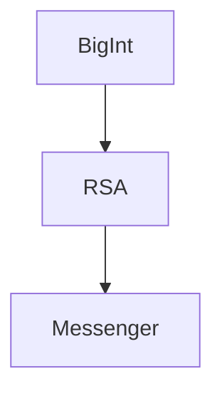

# Welcome to Parallel Engineering

Parallel Engineering builds small, focused C++ projects around cryptography, large-number arithmetic, and client/server applications.

The current project family is centered on RSA: a custom BigInt library, an RSA implementation and an messenger client/server application using RSA-based concepts.

## Project Relationships

